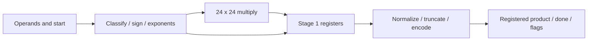

# 32-bit Floating-Point Multiplier — RTL to ASIC

A SystemVerilog floating-point multiplier developed as an individual academic
project, covering RTL design, self-checking verification, logic synthesis and
physical implementation with Cadence tools and GPDK045 standard cells.

The design uses the binary32 bit layout with **project-specific arithmetic and
exception rules**. It is not a fully IEEE 754-compliant multiplier.

## Project highlights

- Two registered processing stages: operand classification and 24 × 24-bit
  significand multiplication, followed by normalization and result encoding.
- One input transaction per cycle; a transaction captured at edge N produces
  its result at edge N+1.
- Normal and subnormal operands, signed zero, infinity and explicit exception flags.
- Self-checking vector, directed exception and streaming/reset testbenches.
- Cadence Xcelium simulation, Genus synthesis and Innovus place-and-route flow.



## Results and validation status

Historical reports from June 2026 record a 4 ns clock target (250 MHz), 3,099
mapped synthesis cells and 3,004 post-layout cells. The archived post-layout
setup report shows **+0.002 ns slack** for its reported path. These are historical
observations, not a new timing-closure or maximum-frequency claim.

Archived simulation logs report 100 passing vectors and passing directed flag
cases at RTL, post-synthesis and post-layout levels. **The revised scripts and
testbenches have not yet been executed on the licensed server.** See
[results and limitations](docs/results.md) for provenance and pending validation.

## Run on a licensed Linux host

```bash
cp config/example.env config/local.env
# Edit local.env for the site's Cadence installation, license environment and PDK.
make test       # RTL: vectors, flags, streaming/reset protocol
make validate   # RTL, synthesis, layout, gate-level SDF tests and power estimates
```

All EDA execution requires access to the academic remote environment. Cadence
software, licenses, cell models and PDK files are external dependencies. No
local simulator or public CI runner is required or configured.

## Explore the project

| Directory | Contents |
| --- | --- |
| `frontend/` | Synthesizable RTL and verification sources |
| `backend/` | Synthesis, physical design, timing and power scripts |
| `scripts/` | Environment setup and execution entrypoint |
| `config/` | Portable configuration example |
| `docs/` | Architecture, reproduction and results |

- [Architecture and arithmetic contract](docs/architecture.md)
- [Reproduction guide](docs/reproduction.md)
- [Results, evidence and limitations](docs/results.md)

This repository presents the author's individual implementation and verification
work. Cadence tools and technology libraries are external dependencies. No
redistribution license is assigned in this preparation.
