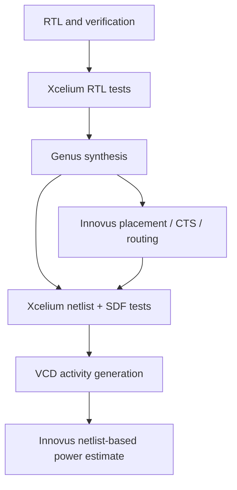

# Reproducing the Cadence flow

## Environment

Run EDA commands on the licensed academic Linux server. The local SSH alias is
configured outside this repository. Use a new, isolated directory for this
portfolio checkout; do not overwrite an existing academic run.

Requirements: Bash, GNU Make, standard Unix utilities, Xcelium, Genus, Innovus,
a valid site license environment, GPDK045 timing/physical data and matching
Verilog cell models. Historical tool releases are listed in the results document.

Copy `config/example.env` to `config/local.env` and edit it on the server. The
configuration is sourced as Bash, so it can load the site's environment modules.
Set `TECH_DIR` and `CELL_MODELS`; override library paths as necessary. The default
library layout matches GPDK045 gsclib045 SVT v4.4 and gpdk045 v6.0 RC data.
If the installation needs a vendor SDF workaround, set `SDF_WORKAROUND` to an
external copy. That optional dependency is not distributed here.

## Commands

From the repository root:

```bash
make help
make test
make synth
make layout
make sim-post-synth
make sim-post-layout
make power
```

`make validate` runs the complete sequence above. Individual commands do not
silently rebuild their prerequisites: synth precedes layout; both precede their
SDF tests and power estimates. `make sim`, `make sim-flags` and
`make sim-protocol` select individual RTL suites. `bash scripts/run.sh <target>`
is equivalent when GNU Make is unavailable.

`period_clk` defaults to 4.000 ns. To override it, set it in the local environment
configuration or export it before execution. Keep test timing sufficiently slow
for the benches' 1 ns settling interval (the supported portfolio target is 4 ns).
The same period feeds the testbenches, synthesis constraints and physical flow;
artifact frequency tags are derived from that period.



## Outputs and completion

Simulation runs are isolated under `build/`. Backend work, reports and generated
deliverables remain under their respective synthesis/layout directories. These
outputs are excluded from Git. Each invocation records source SHA-256 hashes,
UTC start time, action and clock period in `build/<action>-sources.txt`; tool
logs contain their release banners. Keep the local environment configuration
with the run when auditing library/corner choices, but do not publish it.

A simulator exit alone is not success. The runner requires a `TEST PASS` marker
and rejects selected error/timing diagnostics. All benches have a 1 ms watchdog.
Backend scripts emit completion markers only after writing their outputs.
Completion markers are **not signoff**: inspect setup/hold, design-rule reports,
SDF annotation diagnostics and any unconstrained paths before publishing claims.

The power command generates activity from the vector suite followed by an idle
hold interval of approximately the same duration. The modified stimulus timing
changes the workload relative to historical runs; compare fresh results only
when the workload and configuration match. The power script loads netlists and
libraries without a routed parasitic database, so the result is an estimate.

## Public source package

`config/public-files.txt` is the explicit list of public files. To create a
source-only ZIP on Windows:

```powershell
powershell -File scripts/package.ps1
```

The archive is written under `build/`. Transfer this package into a new remote
directory, then create the remote configuration there. Generated outputs and
local configuration are deliberately not selected. Review any future additions
to the manifest before packaging or staging files for publication.

No GitHub Actions workflow requiring institutional credentials is configured.
The previous GUI shortcuts and fixed-duration simulation options are replaced
by batch commands that run to testbench completion; waveform investigation can
be performed directly in the academic tool environment.
